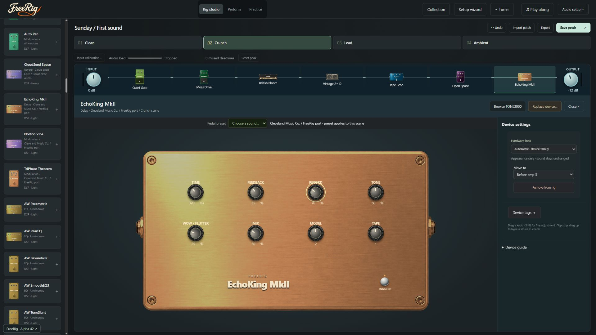
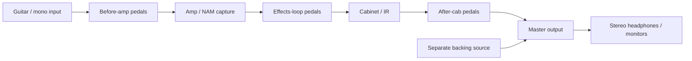
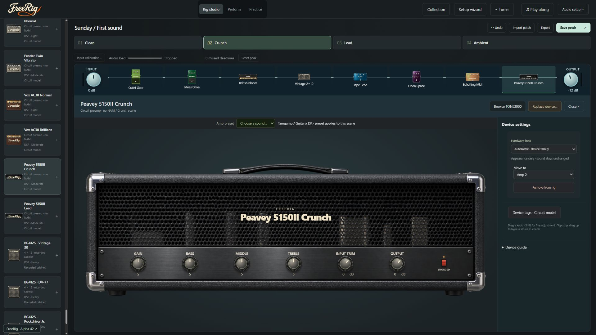

# FreeRig

**Build a guitar rig. Keep it local. Make it yours.**

FreeRig is a Windows desktop guitar suite with a visual pedalboard, native audio processing, NAM captures, cabinet impulse responses, stock effects and eight scenes per patch. Local models and effects work offline; TONE3000 downloads are optional.



> **Alpha software:** the packaged baseline is Alpha 42. Small-buffer audio dropouts are under investigation. Offline tests do not establish live performance on every interface. See [known limitations](docs/FAQ.md#what-are-the-known-limitations).

FreeRig depends on open-source audio engines and recorded assets. See [Credits, upstream code and provenance](docs/CREDITS.md) for named projects, licences, revisions, adaptations and AI artwork disclosure.

## What you can do

- Arrange pedals before the amp, in its effects loop and after the cabinet, with advanced routing available.
- Load local NAM captures and cabinet IRs, or use stock processors without an online account.
- Explore 200 native stock effects, 13 circuit preamp channels and five recorded cabinet configurations with 21 microphone recordings.
- Edit controls on illustrated hardware; save patches, banks, scene settings and artist/style tags.
- Use manufacturer ASIO or Windows audio, and mix a separate backing source with Play along.

Hardware artwork represents families of equipment. Changing its appearance does not change the processor or loaded capture. Circuit amps model preamps; they are not complete power-amp simulations.

## Get started

This repository contains source and documentation. **A source ZIP is not a ready-to-run Windows app.** Packaged builds are not included in Git history. Until a validated GitHub release is published, build using [Contributing](CONTRIBUTING.md), or use an existing complete portable release folder.

1. Extract the complete portable folder and open `FreeRig.exe`. Keep its DLLs, UI files and licences together.
2. Connect your guitar to an instrument/Hi-Z input on your audio interface and connect headphones or monitors.
3. Open **Setup wizard**, then **Audio setup**. Choose the manufacturer's ASIO driver, guitar input and preferably **Same ASIO interface** output.
4. Press **Start audio** explicitly. Start with a simple amp/cab rig and comfortable output level.
5. Add pedals from **Collection**, adjust controls, save the patch and use scenes for variations.

For Windows audio, missing devices, buffer settings and first-sound problems, follow [Audio setup](docs/AUDIO-SETUP.md). See the [full FAQ](docs/FAQ.md) for everyday questions and troubleshooting.

## How the rig works



This diagram shows the standard serial route. Multiple cabinets and advanced connections need their own routing interpretation. Backing audio joins after guitar processing and before master output.

An amp capture reproduces the recorded model at its captured settings. Its input trim changes the signal driving that model; it does not recreate the original amplifier's physical knobs. A cabinet IR represents a recorded speaker/microphone response. If a capture already includes a cabinet, adding another IR may double-filter the sound. [Capture levels and fidelity](docs/CAPTURE-FIDELITY.md) explain the distinction.



## Guides

| I want to…                                 | Read                                                                                          |
| ------------------------------------------ | --------------------------------------------------------------------------------------------- |
| Find answers and fix common problems       | [Full FAQ](docs/FAQ.md)                                                                       |
| Set up my interface and understand latency | [Audio setup](docs/AUDIO-SETUP.md)                                                            |
| Play along with music from another app     | [Play along](docs/PLAY-ALONG.md)                                                              |
| Browse processors and their limitations    | [Effects collection](docs/EFFECTS-COLLECTION.md) · [Effect browsing](docs/EFFECT-BROWSING.md) |
| Understand amps and recorded microphones   | [Circuit amps and cabinets](docs/CIRCUIT-AMPS-AND-CABS.md)                                    |
| Use tags and compare capture levels        | [Tags and capture controls](docs/TAGS-AND-CAPTURE-LEVELS.md)                                  |
| Understand the visual rig                  | [Pedalboard design](docs/PEDALBOARD-DESIGN.md) · [Hardware artwork](docs/HARDWARE-DESIGN.md)  |
| Review the current audio investigation     | [Audio robustness](docs/AUDIO-ROBUSTNESS.md)                                                  |

## Build and contribute

Start with [Contributing](CONTRIBUTING.md), the [architecture map](docs/ARCHITECTURE.md) and [adding a pedal](docs/ADDING-A-PEDAL.md). Native builds require the Windows toolchain and dependencies documented in [native build details](native/README.md).

```powershell
npm ci
npm --prefix ui ci
npm run build
npm run check
```

Readable sources live in `ui/src`, `src/legacy`, `effects` and the organised native folders. Generated bundles are identified by their headers; rebuild them instead of editing them. See [AGENTS.md](AGENTS.md) for compatibility and audio-callback rules.

When reporting a problem, include the version, interface/driver, input/output route, sample rate, buffer size, affected processors and steps to reproduce. Remove account credentials and personal paths from anything you share. See [reporting problems](docs/FAQ.md#how-do-i-report-a-problem).

## Status, history and licences

[CHANGELOG](CHANGELOG.md) records current work; [release history](docs/RELEASE-HISTORY.md) preserves earlier notes. Click the version inside the app for searchable offline history. `release.json` supplies the version; [Releasing](docs/RELEASING.md) describes packaging and validation.

FreeRig carries the [GNU GPL v3 licence](LICENSE). Upstream notices, revisions and asset provenance remain in `native/vendor` and the relevant design guides; portable packages carry their licence notices. Downloaded captures have their own creators and permissions—do not assume they can be redistributed with a patch.
